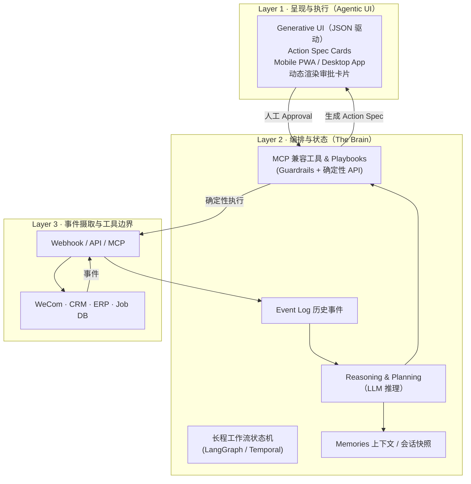

# 02 · 目标架构与四大原语

> 本文描述**最终形态**。当前 POC 只实现了其中最薄的一条竖切（见
> [03-roadmap.md](03-roadmap.md)）。先有蓝图，才好取舍。

## 设计准则

- **解耦**：不把业务写死成「防水维修跟进引擎」，而是通用的事件驱动跟进运行时。
- **确定性边界**：LLM 负责「模糊推理」，所有对业务系统的**写操作**必须经过
  带守卫（Guardrails）和 SOP（Playbooks）的确定性工具。
- **Human-in-the-Loop**：AI 产出 `Suggestion`，人类 `Approval`，系统才 `Action`。

## 三层运行时（MCP 驱动）



## 四大 Agent-native 原语

整个运行时由四个可复用原语组成。POC 阶段它们都还很薄，但接口要从一开始就立住。

### 1. Event Ingestion 事件摄取（= 领域防腐层落点）

- **做什么**：用统一数据结构接入各种源头——销售通话文本、师傅现场照片 OCR、
  工单状态变更 Webhook / DB 轮询。
- **关键职责**：这里是**系统语义→领域语义的翻译边界**。原始 `serviceAppointment`、
  `status=403`、区划码等系统黑话，必须在此翻译成领域语言（`WorkOrder.completed`、
  城市名…），Agent 大脑之后只见领域对象。详见 [04-domain-semantics](04-domain-semantics.md)。
- **开源价值**：任何 B2B 系统把「非结构化文本/日志」丢进来，就能触发引擎。
- **POC 现状**：DB 增量轮询（XLink `serviceAppointment` 完工事件）；领域适配器待立 seam。

### 2. Reasoning & Strategy Mapping 推理与策略映射

- **关键**：**不要写死 If-Else**。要积累的是「动态上下文检索 + LLM 规划」。
- **做什么**：Agent 根据事件检索公司「SOP / 最佳实践知识库」（客诉处理、追加销售），
  再用大模型生成结构化建议。
- **POC 现状**：单轮 LLM 生成 JSON 建议（尚无 SOP 检索，启发式兜底）。

#### 分支治理（v0.2.x 起执行）

- 主流程保持薄编排：`ingest -> enrich -> llm -> polish -> card/trace`。
- 业务分叉优先表驱动（策略映射）而非嵌套 if/else：
  - `event_type -> strategy`
  - `blocker_type -> action template`
  - `priority rules -> rule chain`
- 任何新增分支需可观测（trace 可解释）且可单测。

#### 何时从轻编排升级到 LangGraph/Temporal

满足以下任意两项，触发升级评审：

1. 需要跨天等待的人机多轮状态（如阻塞回填超时重试）。
2. 单工单存在并行子任务且要求失败恢复。
3. 规则模块复杂度明显上升，主流程可维护性下降。
4. 事故复盘中频繁出现“分支路径不可解释”。

### 3. Action Spec & UI Generation 行动规范与 UI 生成

- **最具开源价值的硬资产**：Agent 产出的不是大白话，而是 **Action Spec（行动规范协议）**。
- 前端读取该 JSON，自动渲染对应交互卡片。这种 **「JSON 驱动的动态 Agent 审批 UI」**
  是整个软件行业极度缺少的开源组件。

```json
{
  "action_type": "PROPOSAL_SEND",
  "reasoning": "现场检测发现3处注浆点，业主因价格犹豫，需发送阶梯式降价方案",
  "ui_component": "InteractiveApprovalCard",
  "payload": {
    "customer_id": "123",
    "templates": ["方案A: 全面注浆", "方案B: 局部修补"],
    "draft_text": "尊贵的业主，针对您家厨房的漏水..."
  }
}
```

- **POC 现状**：扁平 JSON（needs_follow_up / priority / reason / suggested_action /
  sentiment），渲染为企微 Markdown 卡片。是 Action Spec 的雏形。

### 4. Execution & Webhook Router 执行与路由

- **做什么**：人类点「同意」后，把确定性 Action 派发出去——调企微 API 发消息、
  调 CRM 改字段、写 Turso 数据库。
- **POC 现状**：企微群机器人推送 + Turso/sqlite 写处理记录（幂等）。

## 从 POC 到目标的演进映射

| 原语 | POC（当前） | 目标形态 |
|------|------------|----------|
| Event Ingestion | DB 轮询完工工单 | 多源（OCR / 通话 / Webhook）统一摄取 |
| Reasoning | 单轮 LLM + 启发式 | SOP 向量检索 + LLM 规划 + 长程状态 |
| Action Spec | 扁平 JSON → 企微卡片 | 强类型协议 → Generative UI 组件库 |
| Execution | 企微推送 + 追踪库 | MCP 工具 + Guardrails + 多系统派发 |
