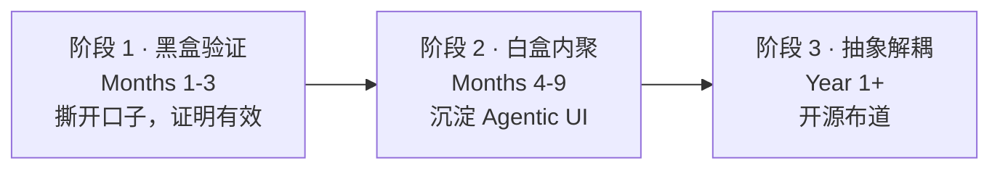

# 03 · 路线图与当下进展

> 从防水维修现场服务，演进为通用的 **Agent-native 工作流运行时**。
> 三个阶段层层递进，每一阶段都要先交付可验证的价值，再进入下一阶段。

---

## 阶段 1 · 黑盒验证（Months 1-3）

**唯一目标**：不改动现有 UI 和架构，证明 Agent 有效。

- **做法**：监听工单完工事件 → 后台脚本让引擎分析非结构化文本 → 生成建议
  **直接用企微机器人发到现有客服/销售群**（连 UI 都不用改）。
- **资产积累**：初步 Event Ingestion 逻辑 + 基于防水 SOP 的初步 Reasoning。
- **证明点**：周报里展示「AI 提醒的跟进，多捞回 X 个订单，提升 Y% 转化率」。

## 阶段 2 · 白盒内聚（Months 4-9）

**目标**：获得业务信任后，把 Agentic UI 深度内聚，优化人机协同。

- **做法**：在 CRM/客服操作界面嵌入「Agent 建议面板」（React 组件）。
  Agent 产出强类型 JSON，前端渲染可交互的「审批卡片」（Approve/Reject），
  人类点同意后系统确定性执行。
- **领域对齐**：改为消费 `business_3_0` ERM 暴露的领域读模型（`WorkOrder` 等），
  消除直连 Mongo 的影子真源；Action Spec 引用领域 id。见 [04-domain-semantics](04-domain-semantics.md) Phase 2。
- **资产积累**：Generative UI（Action Spec Cards）协议与 React 组件库；
  本地化的现场 SOP 向量知识库。
- **证明点**：从「提醒关怀」升级到「自动起草报价单、一键发起审批」，
  一个客服处理过去三倍的跟进量，降低漏失率。

## 阶段 3 · 抽象解耦与开源（Year 1+）

**目标**：剥离业务逻辑，形成通用运行时原语，实现开源价值。

- **做法**：架构大解耦，把「防水/工单」相关业务逻辑（报价模板、客诉 SOP）
  抽成配置文件；底层核心（事件队列、长程状态、动态 UI 协议、工具调用守卫）
  解放为独立开源项目 **Agentic Operational Workflow Runtime**。
- **资产积累**：可被任何 CRM/ERP/招聘系统复用的 Agent 运行时总线 + 开源影响力。

---

## 当下进展（Phase 1 · POC）

POC 引擎已落地并跑通，作为阶段 1 的最小竖切。详见仓库根 `README.md`。

| 能力 | 状态 |
|------|------|
| DB 增量轮询完工工单（XLink `serviceAppointment`，status=403） | ✅ 已对 dev 库只读验证 |
| 幂等水位线（追踪库去重，失败下轮重试） | ✅ |
| LLM 生成结构化建议（含无 key 启发式兜底） | ✅ 接口就位 |
| 企微群机器人 Markdown 卡片推送 | ✅ DRY-RUN 已验证 |
| GitHub Actions 定时触发 | ✅ workflow 就位 |
| DRY_RUN 零依赖端到端跑通 | ✅ |

### 下一步（让 Phase 1 真正产生业务数据）

1. 申请 prod `xlink` 只读账号，复核生产 `status=403` 口径与量级。
2. **立领域语义 seam**：把系统码（`403`/区划码）隔离进唯一的领域适配器，
   引擎其余部分改说领域语言，对齐 `12-domain-glossary`（见
   [04-domain-semantics](04-domain-semantics.md)）。**廉价保险，建议当下就做。**
3. 接真实 LLM key，用真实工单产出建议，人工评估质量。
4. 开真实企微推送，到目标群试运行，开始**记录采纳率 / 转化数据**。
5. 沉淀首版防水维修跟进 SOP，喂给 Reasoning 原语。

### 已知待增强

- 工单 `describe`（备注）偏稀疏 → 跟进文本素材有限，需关联 `workflowNode`
  等补全（见 [xlink-data.md](xlink-data.md)）。
- 当前 Action Spec 为扁平 JSON，尚未演进到 Generative UI 协议（阶段 2）。
