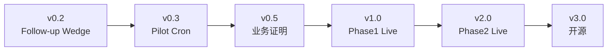

# 05 · 版本规划（可发布迭代 → Live）

> **Scope 不变**：Follow-up Action Engine（工单完工 → AI 跟进建议 → 人工采纳 → 执行）。
> **交付纪律**：每个版本必须 **完整闭环、可独立验证、可发布**（有 tag、有验收清单、有回滚方式），
> 禁止「半个功能」上线。
>
> 与 [03-roadmap.md](03-roadmap.md) 的关系：03 是战略三阶段；本文是 **工程可执行版本切分**。  
> **版本摘要时间线**（讨论排期用）：[changelog.md](changelog.md)（对齐 business_3.0 的 `docs/changelog.md`）。

## 版本总览

| 版本 | 代号 | 目标一句话 | 发布形态 | 对应战略阶段 |
|------|------|------------|----------|--------------|
| **v0.1** | scaffold | POC 闭环：防腐层 + trace + 混元/启发式 + 企微预览 + dev mongo | **tag `v0.1.0`** | Phase 1 前 |
| **v0.2** | follow-up-wedge | **Follow-up 主战场**：仅 206 待签约停滞 + 管家路由 | 开发中 | Phase 1 前 |
| **v0.3** | pilot-cron | GHA 定时 + Turso 云追踪 + 试点群（数据仍 dev→prod） | **首个可对外试点** | Phase 1 黑盒 |
| **v0.4** | context-sop | 上下文补全 + SOP v1 + 可观测增强 | 试点迭代 | Phase 1 黑盒 |
| **v0.5** | proof-metrics | 采纳/效果度量 + 周报自动化 | **业务证明包** | Phase 1 收官 |
| **v1.0** | live-phase1 | 生产 Cron 稳定运行 + Runbook + SLO | **Phase 1 Live** | Phase 1 Live |
| **v1.1** | action-spec | 强类型 Action Spec + 审批回写 | 内测 API | Phase 2 起步 |
| **v1.2** | agent-panel | business_3_0 建议面板（只读→审批） | 产品内测 | Phase 2 |
| **v2.0** | live-phase2 | 审批后确定性执行 + ERM 单一真源 | **Phase 2 Live** | Phase 2 Live |
| **v3.0** | runtime-oss | 业务配置化 + 核心运行时开源 | 开源发布 | Phase 3 |



---

## 横切策略（全版本有效）

### 数据：真实优先，mock 降级

| 环境 | `FSM_SOURCE` | 库 |
|------|--------------|-----|
| **v0.2 起默认** | `mongo` | dev `xlinkdemo`（只读） |
| 试点 / Live | `mongo` | dev → prod `xlink` 分阶段切换 |
| 仅 CI 离线 | `mock` | 无网跑结构测试，**不作为封版路径** |

### LLM：免费为主，付费验证（见 [06-llm-providers.md](06-llm-providers.md)）

| `LLM_PROVIDER` | 用途 |
|----------------|------|
| **heuristic** | 走通非 LLM 链路（捞取、trace、企微预览），零 API 成本 |
| **hunyuan**（默认） | 腾讯混元 Lite，对齐 stockwise 免费档 |
| **deepseek** | 抽样对比质量；业务演示时再开 |

**纪律**：日常开发与 cron 用混元；DeepSeek 只用于「每周 N 单对照样本」，不作为默认成本模型。

---

## v0.1 · scaffold（已发布 `v0.1.0`）

**目标**：证明 **Event → Reasoning → Trace → Outbound → 幂等** 技术路径可跑通，零侵入 XLink。

### 已交付

| 能力 | 说明 |
|------|------|
| 领域防腐层 | `domain.py`：`serviceAppointment` → `WorkOrder` |
| 摄取 | `FSM_SOURCE=mongo`（dev）/ `mock`（CI） |
| 推理 | `heuristic` / `hunyuan` / `deepseek`；trace 全量落库 |
| 执行 | 企微 Markdown；**默认 `DRY_RUN=true` 预览** |
| E2E | `--reset-tracking` 清表（保留 db 文件，GUI 可刷新） |
| 文档 | `05`–`07`、`xlink-data` |

### 已知边界（v0.2 要解决）

- 事件源仅 `status=403` 已完工，与业务主战场 **206 待签约** 不匹配。
- 无管家维度路由（`exts.supervisorId`）。
- 输出为扁平建议，尚无 **Action Spec + Approval** 契约。

---

## v0.2 · follow-up-wedge（当前冲刺）

**目标**：对齐研讨 **Follow-up Action Engine** 切口——在 **wait → follow-up** 主战场产生可审批建议，
用四位管家（刘沐泽、李小军、刘清瑞、李俊达）**生产只读**数据验证 ROI。

**规格 SSOT**：[08-follow-up-wedge-spec.md](08-follow-up-wedge-spec.md)（含 **§6 v0.2.0 封版共识**）

### v0.2.0 封版共识（已定）

| # | 项 | 决定 |
|---|-----|------|
| 1 | 数据 | **生产 `xlink` 只读**；dev 仅开发调试 |
| 2 | 企微 | **不发群**；`DRY_RUN=true` 审阅卡片/日志 |
| 3 | Agent | **`AGENT_MODE=steps` 必做**；enrich 产出 **业务查证**（仅报价 B + 签约）并展示在卡片与 trace |

### 交付范围

| 原语 | 本版 |
|------|------|
| Event Ingestion | P0：**仅 `206` 待签约** 停滞 SLA；204 不纳入；归属 `exts.supervisorId` |
| Reasoning | 混元默认；prompt 含 **状态 + 停留天数**；仍只读 Mongo |
| Action Spec | 扩展 `FollowUpSuggestion` → 含 `event_type`、`stale_days`、`housekeeper_id` |
| Execution | 企微卡片按管家分送（试点）；仍为 **approval 前 suggestion** |
| 可观测 | trace 增加 `event_type`；水位线按 `(event_type, work_order_id)` |

### v0.2 验收清单（打勾即 tag `v0.2.0`）

**工程（dev 可先验）**

- [x] dev 只读：能捞到 **206** 工单（204 已排除；14 天窗）
- [x] 管家路由：卡片带归属管家 / 状态 / 停留天数 / 事件类型
- [x] `dedupe_key` 幂等；`reasoning_traces.event_type` + `steps_json`
- [x] `LLM_PROVIDER=hunyuan` + `DRY_RUN` 预览；`--reset-tracking`
- [x] 文档：08 / 09 / sops 大纲
- [x] `AGENT_MODE=steps` + enrich（仅报价 B、签约、`business_verdict`）
- [x] 卡片含 **系统查证** 行（steps 模式）

**封版（必须生产只读）**

- [ ] **生产 `xlink`**：`FSM_EVENT_STATUSES=206` + `FSM_MAX_AGE_DAYS=14` + 四位管家，能捞取并推理
- [ ] **`AGENT_MODE=steps`**：日志/卡片中 **查证结论** 与建议一致（已签约不单催签等）
- [ ] **不发群**：仅 `DRY_RUN=true` 审阅 ≥10 条样本（业务可读）
- [ ] ADR-008 与本节共识已写入 changelog

### v0.2.1（紧随 v0.2.0 的小版本）

**目标**：不依赖“系统天然有阻塞字段”，先用 Agent 引导管家补齐关键上下文。

**交付范围（最小可用）**：

1. 卡片增加提示：`阻塞信息：待采集`（默认未知）。
2. 提供最小回填语法：`A价格/B时机/C方案/D无响应 + 一句话`。
3. 回填结果先写入 `reasoning_traces`（或等价轻量表），不改业务主库。

**验收**：

- [ ] 5 条样本中，管家可在 10 秒内完成回填（可用性验证）。
- [ ] 回填字段可被下一轮推理读取并在建议中体现。
- [ ] 无回填时系统保持 `UNKNOWN`，不伪造阻塞结论。

### agent-steps（v0.2.0 主验收轨）

见 [10-agent-steps-demo.md](10-agent-steps-demo.md)。**封版必须用 `steps`**；`oneshot` 保留作对照/降级。

### 本地运行参考

```bash
cp .env.example .env
pip install -r requirements.txt
python agent_cron_engine.py --reset-tracking
```

---

## v0.3 · pilot-cron（建议 1–2 周）

**目标**：第一次 **7×24 无人值守试点**——在 v0.2 已验证的 dev 真实数据链路上，
把追踪迁到 **Turso**，用 GitHub Actions 定时跑，不依赖开发者笔记本。

### 交付范围

| 原语 | 本版增厚 |
|------|----------|
| Event Ingestion | 与 v0.2 相同（仍 dev；prod 只读账号并行申请） |
| Reasoning | 默认 **hunyuan**；trace 写入 **Turso** |
| Action Spec | 保持扁平 `FollowUpSuggestion` + 企微 Markdown |
| Execution | 试点群 webhook；失败重试；**每日上限**（防刷屏） |

### 工程项

1. GitHub Actions Secrets/Vars 配齐；`TRACKING_SOURCE=cloud`（Turso）。
2. 新增 `FSM_LOOKBACK_HOURS` / `FSM_BATCH_LIMIT` 生产合理默认值。
3. 运行报告：每轮结束写 `run_summary` 表或日志 artifact（处理数/成功/失败/token 合计）。
4. Runbook 一页：`docs/runbooks/pilot-cron.md`（如何手动触发、如何停 cron、如何查 trace）。
5. 阻塞采集统计：新增每周指标（采集率、平均回填时延、`UNKNOWN` 占比）。

### 明确不做

- 不改 XLink 业务系统、不做审批 UI。
- 不接 SOP 向量库、不关联 workflowNode（留给 v0.4）。

### 发布与验证

- **发布**：打 tag `v0.3.0`；Actions `workflow_dispatch` + schedule 仅试点时段（如工作日 9–18）。
- **验证**：
  - 连续 3 天 cron 无人工干预，trace 可查，无重复推送。
  - 业务方在试点群确认「建议可读、无胡言」≥10 条样本评审。

---

## v0.4 · context-sop（建议 2–3 周）

**目标**：提升建议质量——补全跟进文本素材，注入首版防水维修 SOP。

### 交付范围

| 原语 | 本版增厚 |
|------|----------|
| Event Ingestion | 防腐层扩展：按 `work_order_id` 关联 `workflowNode` / 关键 `exts`（只读） |
| Reasoning | SOP v1（Markdown/JSON 配置）拼入 system prompt；可选「仅高优先级才推送」 |
| 可观测 | `follow_up_logs` 增加 `sop_version`、`context_sources`；trace 增加 `context_snapshot` |

### 工程项

1. `domain.py`：`enrich_work_order_context(wo)` 只读补全。
2. `sops/waterproof-follow-up-v1.md`（配置，非硬编码业务 if-else）。
3. 配置开关：`REQUIRE_FOLLOW_UP_ONLY_HIGH=false` 等试点调参。
4. 把已采集的阻塞类型接入 SOP 话术分支（无采集仍走 `UNKNOWN` 通道）。

### 明确不做

- Action Spec 协议升级（v1.1）。
- business_3_0 嵌入（v1.2）。

### 发布与验证

- **发布**：tag `v0.4.0`；试点群切换或并行 A/B（旧版 vs 新版）一周。
- **验证**：
  - 对比 v0.3：业务盲评「更有用」比例 ≥ 60%（样本≥20）。
  - describe 为空的工单，补全后建议非空率提升可量化。

---

## v0.5 · proof-metrics（建议 2 周）

**目标**：Phase 1 **可量化证明包**——管理层能看懂的数字，不是「感觉 AI 有用」。

### 交付范围

| 能力 | 说明 |
|------|------|
| 建议曝光 | 每条推送带 `suggestion_id`，企微卡片 footer 可选手工标记 |
| 采纳信号 v1 | 轻量：群消息反应 / 表单链接「已处理/忽略」/ 或运营 Excel 回灌脚本 |
| 效果指标 | 脚本 `scripts/weekly_proof_report.py`：推送数、采纳率、高优先级占比、token 成本 |
| 业务对照 | 可选：与 Metabase/现有报表对齐「同期完工单 → 二次签约」粗对比 |

### 工程项

1. DB 表：`suggestion_outcomes`（work_order_id, suggestion_id, outcome, noted_at）。
2. 周报 Markdown 自动生成（可贴企微文档或邮件）。

### 明确不做

- 全自动 CRM 写回（v1.1+）。
- 精确归因（因果证明留业务分析，引擎只提供分母分子）。

### 发布与验证

- **发布**：tag `v0.5.0`；连续 2 周出周报。
- **验证**：
  - 至少 1 份对管理层可读的「AI 跟进试点周报」被采用。
  - 有明确数字：如「推送 N 条，人工确认跟进 M 条，其中 X 条带来二次触达/签约线索」。

---

## v1.0 · live-phase1（建议 1–2 周硬化）

**目标**：**Phase 1 正式 Live**——生产 Cron、SLO、告警、权限与合规收口。

### 交付范围

| 维度 | 标准 |
|------|------|
| 数据 | prod `xlink` 只读；口径与 [xlink-data.md](xlink-data.md) 签字确认 |
| 运行 | GitHub Actions 或等价调度；Turso 追踪；Secrets 轮换流程 |
| 可靠性 | 单轮失败不影响下轮；LLM/企微失败有告警（邮件/企微运维群） |
| 安全 | 密钥不进库；日志脱敏 phone；只读账号最小权限 |
| 文档 | Runbook、架构图、on-call 一页纸 |

### SLO 建议（首期）

- Cron 成功率 ≥ 99%（排除上游 Mongo 不可用）。
- 单工单端到端 P95 &lt; 60s（含 LLM）。
- 重复推送率 = 0（幂等）。

### 发布与验证

- **发布**：tag `v1.0.0`；生产群（非仅试点）或分城市分群路由。
- **验证**：
  - 连续 30 天无 P0 事故。
  - 业务方签字「Phase 1 可常态化运行」。

**Phase 1 Live 定义**：黑盒、企微为主、人类采纳；**不承诺**产品内审批与自动写 CRM。

---

## Phase 2 版本（白盒内聚）

### v1.1 · action-spec

- `FollowUpSuggestion` → 强类型 **Action Spec**（`action_type` / `ui_component` / `payload`）。
- 审批结果 webhook 回写 `suggestion_outcomes`。
- JSON Schema 校验 + 版本字段 `spec_version`。

**验证**：mock Spec 可被独立 JSON 校验；至少 2 种 `action_type` 端到端。

### v1.2 · agent-panel

- `business_3_0` 嵌入「Agent 建议流」只读列表。
- 消费 Turso/API；展示 trace 摘要；Approve/Reject 调 v1.1 webhook。

**验证**：管家在 Web 内完成「看建议 → 点同意」不再依赖翻群。

### v2.0 · live-phase2

- 审批后 **确定性执行**（企微发客户草稿 / CRM 字段更新经 Guardrails API）。
- Event Ingestion 改消费 **ERM 领域读模型**，删除直连 Mongo 的影子路径。
- SOP 向量检索（可选 RAG）上线。

**验证**：单客服跟进吞吐量提升可量化；漏跟率下降。

---

## Phase 3 版本（抽象开源）

### v3.0 · runtime-oss

- 防水业务 → `bindings/xlink-wpf.yaml` + SOP 包。
- 核心包：`agent-loop-runtime`（ingestion / reasoning / spec / execution 四原语）。
- Generative UI 组件库独立 npm 包。

**验证**：第三方仓库用 mock binding 48h 内跑通同样链路。

---

## 迭代节奏建议

| 阶段 | 版本 | 日历（参考） | 决策门 |
|------|------|--------------|--------|
| 现在 | v0.2 封版 | 本周 | dev 真实数据 + 混元 E2E + trace |
| 试点 | v0.3 → v0.4 | 第 2–5 周 | GHA cron + 提质（SOP/上下文） |
| 证明 | v0.5 | 第 6–7 周 | 周报有数字、管理层认可 |
| Live | v1.0 | 第 8–9 周 | 安全/运维签字 |
| 产品化 | v1.1 → v2.0 | 第 10–24 周 | 「接进操作界面」需求明确 |

**决策门纪律**：未达上一版验收清单，**不启动下一版开发**（可并行写文档与运维准备）。

---

## 每版通用「可发布」检查单

复制到每个 PR / Release Notes：

1. **闭环**：Event → Reasoning → Trace → Outbound → 水位线 全路径可演示。
2. **可验证**：开发路径 `DRY_RUN=true`（真数据+真 LLM+企微预览）；试点/Live 再单独验真发。
3. **可回滚**：上一 tag 可一键恢复；Cron 可 disable。
4. **可观测**：能回答「昨晚 3 点为什么没推？」（trace + run_summary）。
5. **领域纪律**：系统码只出现在 `domain.py`（或 binding 配置）。
6. **文档**：README + 本文件该版本节 + Runbook 变更。

---

## 参见

- [01-vision.md](01-vision.md) · [02-architecture.md](02-architecture.md) · [03-roadmap.md](03-roadmap.md)
- [04-domain-semantics.md](04-domain-semantics.md) · [xlink-data.md](xlink-data.md)
