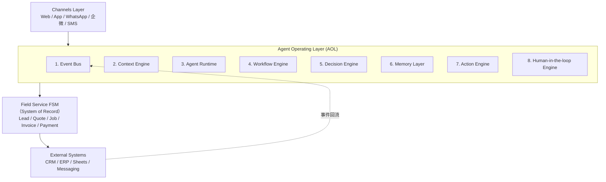
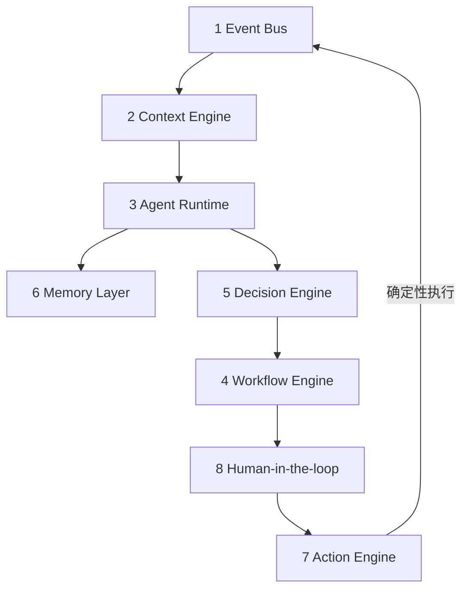

# 02 · 系统架构规格（FS-AOL System Architecture Specification v1.0）

> **Field Service Agent Operating Layer（FS-AOL）**：运行在 Field Service FSM 之上的
> **Agentic Business Execution Layer**。本文是架构 SSOT，描述**目标形态**；
> 当前 POC 只实现其中最薄的一条竖切（见 [PUB-03-roadmap.md](PUB-03-roadmap.md) Stage 0），
> 各组件均标注 **POC 现状**。愿景层见 [PUB-01-vision.md](PUB-01-vision.md)。

---

## 1. 系统定位（System Definition）

```text
FSM = System of Record（记录系统）
AOL = System of Action（执行系统）
```

| | FSM 负责 | AOL 负责 |
|---|----------|----------|
| 职责 | 数据记录、状态存储、业务事实 | 业务决策、流程推进、自动执行、人机协同 |

> **FSM tells you what happened. AOL decides and executes what happens next.**

---

## 2. 设计目标（Design Goals）

**2.1 业务目标**

- 提升 lead → close 转化率
- 缩短报价时间
- 提高 follow-up 响应率
- 提升整体 revenue efficiency

**2.2 系统目标**

- 将 FSM 从「被动系统」变为「主动系统」
- 将业务流程从「人工驱动」变为「Agent 驱动」
- 实现 multi-agent 协同执行

**2.3 技术目标**

- Event-driven architecture
- Agent runtime abstraction
- 可插拔 workflow engine
- 可扩展行业 Agent SDK
- 可观测 agent 行为与 ROI

---

## 3. 总体架构（High-Level Architecture）



### 设计准则（贯穿全层）

- **System of Action**：AOL 是 value layer，FSM 是 commodity layer（可替换）。
- **解耦**：不把业务写死成「防水维修跟进引擎」，而是通用的事件驱动 Agent 运行时。
- **确定性边界**：LLM 负责「模糊推理」；对业务系统的**写操作**必须经过带守卫
  （Guardrails）和 SOP（Playbooks）的确定性工具。
- **Human-in-the-Loop**：AI 产出 `Suggestion`，人类 `Approval`，系统才 `Action`。

---

## 4. AOL Core 组件定义（Core System Modules）



### 4.1 Event Bus（事件总线）

**职责**：统一接收所有业务事件，作为系统驱动源。

**Event Schema**

```json
{
  "event_type": "QuoteSent",
  "entity_id": "quote_123",
  "customer_id": "cust_456",
  "timestamp": 123456789,
  "payload": {}
}
```

**核心事件**：`LeadCreated` · `CustomerContacted` · `QuoteCreated` · `QuoteSent` ·
`QuoteViewed` · `CustomerSilent` · `FollowUpTriggered` · `JobScheduled` ·
`JobCompleted` · `PaymentReceived`

**POC 现状**：尚无独立总线；以 DB 增量轮询 XLink `serviceAppointment`（v0.2 聚焦
`206` 待签约停滞）模拟事件源。统一 Event Schema 是 Stage 1 的首要抽象。

### 4.2 Context Engine（上下文引擎）

**职责**：构建统一业务上下文（跨 FSM / CRM / external data）。

**Context Types**：Customer / Opportunity / Quote / Job Context、Interaction Timeline。

**输出（统一 JSON）**

```json
{
  "customer_profile": {},
  "history": [],
  "current_state": {},
  "risk_score": 0.72,
  "last_interaction": ""
}
```

**POC 现状**：`AGENT_MODE=steps` 的只读 enrich 已产出工单级上下文（报价 B / 签约 /
渠道部位 / 业务提示）；这是 Context Engine 的雏形。**系统码→领域语义的翻译边界**
见 [PUB-04-domain-semantics.md](PUB-04-domain-semantics.md)。

### 4.3 Agent Runtime（Agent 运行时）

**职责**：负责 agent 生命周期管理——registration / trigger / state / retry-rollback / logging。

**Agent Interface**

```typescript
interface Agent {
  onEvent(event, context)
  decide(context)
  act(decision)
}
```

**POC 现状**：单 Agent（Follow-up）以函数式管线运行，`reasoning_traces` 落库全过程；
正式 Runtime 抽象（多 Agent 注册/触发）属 Stage 1。

### 4.4 Workflow Engine（工作流引擎）

**职责**：支持 multi-agent orchestration。

**Flow Types**：Sequential / Conditional / Parallel / Human-approval flow。

**示例**：`Qualification → Estimate → Follow-up → Closing`

**POC 现状**：主流程为薄编排单链路，见下文 §12 分支治理与升级门槛。

### 4.5 Decision Engine（决策引擎）

**职责**：生成业务决策建议——priority ranking / probability scoring /
recommendation generation / risk detection。

**示例输出**

```json
{
  "next_action": "FollowUpNow",
  "confidence": 0.82,
  "reason": "customer silent 72h",
  "recommended_message": ""
}
```

**POC 现状**：单轮 LLM 生成 v0.2 中文结构化建议 + 启发式兜底；scoring/风险识别待引入。

### 4.6 Memory Layer（记忆层）

**职责**：长期 + 短期业务记忆存储。

**分类**：Session Memory / Customer Memory / Business Pattern Memory / Agent Memory。

**POC 现状**：仅 `reasoning_traces`（短期/审计）；客户与业务规律记忆属 Stage 1+。

### 4.7 Action Engine（执行引擎）

**职责**：执行所有外部动作——Send message（企微/SMS/Email）/ Create quote /
Create job / Update FSM state / Notify human / Trigger workflow。

**POC 现状**：企微群机器人推送 + Turso/sqlite 写处理记录（幂等）；默认 `DRY_RUN=true` 预览。

### 4.8 Human-in-the-loop Engine

**职责**：控制关键决策点。

**Mechanism**：`Agent suggests → Human approves → System executes`。

**Approval Types**：pricing / discount / escalation approval。

**POC 现状**：以 `DRY_RUN` + 人工审阅卡片实现「建议不直发」；结构化审批回写属 v1.1。

---

## 5. Agent Layer（业务 Agent）

| Agent | 输入 | 输出 | 状态 |
|-------|------|------|------|
| **Qualification** | Lead data / channel source / 首次互动 | lead score / priority / next step | 规划中 |
| **Estimate** | job site data / images / FSM rules | quote / material list / cost breakdown | 规划中 |
| **Follow-up** | quote status / silence duration / 互动历史 | follow-up plan / message / timing | **POC 已落地** |
| **Closing** | quote history / engagement data | discount strategy / closing recommendation | 规划中 |

> Follow-up Agent 是第一个生产级 Agent（ROI 直接、易验证、不依赖复杂行业知识）。

---

## 6. FSM Layer（System of Record）

**Entities**：Customer / Lead / Quote / Job / Invoice / Payment。

**特性**：

- immutable event log recommended（推荐事件溯源）
- external replaceable（可被外部 FSM 替换）
- **not business logic owner**（业务逻辑不归 FSM；FSM 走向 commodity layer）

---

## 7. Integration Layer

**Supported Systems**：CRM（HubSpot 等）/ ERP / Excel·Sheets / Messaging systems /
FSM systems（ServiceTitan-like）。

**POC 现状**：仅接 XLink Mongo（只读）+ 企微 webhook。

---

## 8. Analytics & Observability

**业务 Metrics**：conversion rate uplift / follow-up response rate /
quote speed reduction / revenue per lead / agent effectiveness score。

**Agent Monitoring**：success rate / intervention rate / override rate / latency。

**POC 现状**：`reasoning_traces` 提供逐步可审计轨；业务度量包属 v0.5 proof-metrics。

---

## 9. Security & Multi-Tenant

- RBAC、tenant isolation、audit log、encryption、permissioned agents。
- **POC 现状**：单租户；只读账号最小权限；密钥不入库、日志脱敏 phone。多租户属 SaaS 阶段。

---

## 10. Deployment Model

| 阶段 | 形态 | 对应 Stage（roadmap） |
|------|------|----------------------|
| Phase 1 | embedded in existing FSM | Stage 0 |
| Phase 2 | standalone AOL layer | Stage 1–2 |
| Phase 3 | full SaaS platform | Stage 2–3 |
| Phase 4 | open ecosystem / marketplace | Stage 3 |

---

## 11. 开源策略（关键）

| 范围 | 内容 |
|------|------|
| **Open（开源）** | Event Bus、Agent Runtime、Workflow Engine、Basic Memory Layer |
| **Closed（护城河）** | Industry Packs、Agent Marketplace、Hosted platform、Data intelligence |

> 纪律：先赢闭环业务指标，再平台化，最后才分层开源。详见 [PUB-03-roadmap.md](PUB-03-roadmap.md)。

---

## 12. 当前实现视角：四大原语 + 分支治理

> 八大组件是**目标形态**；当前 POC 用四个可复用原语先把接口立住，
> 它们正是 AOL Core 的最小实现切面：
> Event Ingestion ≈ Event Bus + Context Engine；Reasoning ≈ Decision Engine；
> Action Spec/UI ≈ Action Engine 的协议；Execution ≈ Action Engine 的派发。

### 12.1 Event Ingestion 事件摄取（= 领域防腐层落点）

- **关键职责**：**系统语义→领域语义的翻译边界**。原始 `serviceAppointment`、
  `status` 码、区划码等系统黑话，必须在此翻译成领域语言（`WorkOrder` / 城市名…），
  Agent 大脑之后只见领域对象。详见 [PUB-04-domain-semantics.md](PUB-04-domain-semantics.md)。
- **POC 现状**：DB 增量轮询（XLink `serviceAppointment`，v0.2 聚焦 206 停滞）。

### 12.2 Reasoning & Strategy Mapping 推理与策略映射

- **关键**：**不要写死 If-Else**，积累「动态上下文检索 + LLM 规划」。
- **POC 现状**：单轮 LLM 生成 JSON 建议 + steps enrich，启发式兜底。

#### 分支治理（v0.2.x 起执行）

- 主流程保持薄编排：`ingest -> enrich -> llm -> polish -> card/trace`。
- 业务分叉优先表驱动（策略映射）而非嵌套 if/else：
  - `event_type -> strategy`
  - `blocker_type -> action template`
  - `priority rules -> rule chain`
- 任何新增分支需可观测（trace 可解释）且可单测。

#### 何时从轻编排升级到 Workflow Engine（LangGraph/Temporal）

满足以下任意两项，触发升级评审：

1. 需要跨天等待的人机多轮状态（如阻塞回填超时重试）。
2. 单工单存在并行子任务且要求失败恢复。
3. 规则模块复杂度明显上升，主流程可维护性下降。
4. 事故复盘中频繁出现「分支路径不可解释」。

### 12.3 Action Spec & UI Generation 行动规范与 UI 生成

- **最具开源价值的硬资产**：Agent 产出的不是大白话，而是 **Action Spec（行动规范协议）**，
  前端读取该 JSON 自动渲染交互卡片（JSON 驱动的动态 Agent 审批 UI）。

```json
{
  "action_type": "PROPOSAL_SEND",
  "reasoning": "现场检测发现3处注浆点，业主因价格犹豫，需发送阶梯式降价方案",
  "ui_component": "InteractiveApprovalCard",
  "payload": {
    "customer_id": "123",
    "templates": ["方案A: 全面注浆", "方案B: 局部修补"],
    "draft_text": "尊贵的业主，针对您家厨房的漏水..."
  }
}
```

- **POC 现状**：v0.2 中文结构化 JSON，渲染为企微 Markdown 卡片，是 Action Spec 的雏形。

### 12.4 Execution & Webhook Router 执行与路由

- **做什么**：人类点「同意」后派发确定性 Action——调企微 API、改 CRM 字段、写追踪库。
- **POC 现状**：企微群机器人推送 + Turso/sqlite 幂等写。

---

## 13. 从 POC 到目标的演进映射

| 原语 | POC / Stage 0（当前） | 目标形态（Stage 1→3） |
|------|------------|----------|
| Event Ingestion | DB 轮询 206 停滞工单 | 统一 Event Bus + Context Engine（多源 OCR / 通话 / Webhook） |
| Reasoning | 单轮 LLM + 启发式 + steps enrich | Decision Engine：SOP 检索 + 规划 + scoring + 长程状态 |
| Action Spec | 中文 v0.2 JSON → 企微卡片 | 强类型协议 + Agent SDK → Generative UI 组件库 |
| Execution | 企微推送 + 追踪库 | Action Engine：MCP 工具 + Guardrails + 多系统派发 |

> 演进节奏（Stage 0 闭环 → Stage 1 Runtime → Stage 2 AOL Core → Stage 3 开源生态）
> 见 [PUB-03-roadmap.md](PUB-03-roadmap.md)。

---

## 14. 终局定义（System Definition）

> **FS-AOL is a multi-agent execution layer that sits above FSM systems,
> transforming static field service records into autonomous revenue-driving workflows.**

### 一句话总结

> **FSM tells you what happened. AOL decides and executes what happens next.**
