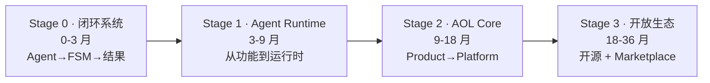

# 03 · 路线图与当下进展

> 我们的路线不是「做一个更好的 FSM」，而是：
> **从一个内部 FSM 增强系统，演化为行业级 Agent Operating Layer（AOL）平台，
> 并通过分层开源形成生态扩张。**

## 核心判断：路径不是「Build → Open Source → Adoption」

```text
Build (vertical wedge)
  → Internal compounding (data + workflow + agents)
    → Productization (AOL core)
      → Selective open source (infra layer)
        → Ecosystem expansion (industry packs + marketplace)
```

> **不能一开始开源，也不能一开始平台化。必须先赢一个「闭环业务系统」。**



---

## Stage 0 · 闭环系统（现在 ~ 3 个月）

**目标**：把 FSM + Agent 变成「可运行的闭环系统」。

> 当前最重要的不是 Agent 数量，而是：**是否已形成「Agent → FSM → 结果」的闭环数据流。**

> 🎯 **唯一产品退出 KPI（可感知）**：管家能在**产品界面（Console）内看见并处置 Follow-up 建议**，
> App 内处置率 ≥70%（不再靠翻群）。对应产品轨 **v1.0 console-mvp**（产品脊柱 S1+S2）。
> 在此之前的 `poc-followup` 仅是 headless 引擎，不算 Stage 0 退出。

### 核心建设

**1. FSM 稳定化（System of Record）**

- Lead / Quote / Job / Payment 状态机清晰；
- 所有状态可追踪（event-sourced 更好）；
- **可被外部系统替换**（很重要——FSM 要走向 commodity layer）。

**2. Follow-up Agent（第一个生产级 Agent）**

选它的原因：ROI 最直接（减少流失）、数据最容易验证、不依赖复杂行业知识。

```text
触发事件：QuoteSent / NoResponse（当前实现：206 待签约停滞）
  ↓ 判断客户状态
  ↓ 生成策略
  ↓ 执行动作（微信 / 短信 / task）
  ↓ 记录结果
```

**3. Event Layer（非常关键）**

引入统一事件命名，否则未来无法抽象 AOL：

```text
LeadCreated · QuoteCreated · QuoteViewed · CustomerSilent · JobCompleted
```

> 对应版本线：POC 引擎 `poc-followup` → `poc-cron`，**产品退出 = v1.0 console-mvp**。

---

## Stage 1 · Agent Runtime（3 ~ 9 个月）

**目标**：从「Agent 功能」变成「Agent Runtime」。

> 不再说「我们有 4 个 Agent」，而是「我们有一个 Agent Runtime，可以运行不同业务 Agent」。

> 🎯 **唯一产品退出 KPI（可感知）**：在**同一 Console**内运行 ≥2 个 Agent，且推理/查证轨可见、
> 管理层有 ROI 看板可引用——即用户能在产品里回答「为什么这么建议」与「带来了什么结果」。
> 对应产品轨 **v1.1 trust → v1.2 proof → v1.3 多 Agent**（产品脊柱 S3+S4）。

### 关键模块

**1. Agent Runtime（雏形 AOL 核心）**：Agent 注册 / 触发 / 状态管理 / 暂停恢复 / 日志。

**2. Context Layer（统一业务视图）**：

```text
Customer Context · Opportunity Context · Job Context · Interaction Timeline
```

**3. Multi-Agent Flow（重点）**：不是独立 Agent，而是**可编排流程**。

```text
Qualification Agent → Estimate Agent → Follow-up Agent
```

**4. Human-in-the-loop（必须做）**：SMB 现实是老板要控关键决策、Agent 不能全自动执行，
所以保留 `Approve / Reject / Modify`。

> 对应版本线：产品 v1.1 trust → v1.2 proof → v1.3 qualification → v1.4 estimate → v1.5 flow（引擎 `poc-context` 支撑）。

---

## Stage 2 · AOL Core（9 ~ 18 个月）

**目标**：AOL Core 成型，可以对外扩展。这是关键分水岭——从 **Product** 变成 **Platform**。

> 🎯 **唯一产品退出 KPI（可感知）**：**非工程人员能在 UI（Studio）内配置一条规则/SOP/编排并生效**，
> 且产品可被外部团队自托管运行。对应产品轨 **v2.0 studio → v2.1 self-host**（产品脊柱 S5）。

### 核心系统

**1. AOL Core（真正的平台）**

| 组件 | 职责 |
|------|------|
| Event Bus | 统一业务事件流 |
| Agent Runtime | 运行所有 Agent |
| Memory Layer | 客户 + 行为 + 历史 |
| Workflow Engine | Agent 之间编排 |
| Decision Layer | 优先级 + 推荐 + scoring |

**2. Agent SDK（开源候选）**：开始定义「如何写一个 Agent」。

```typescript
onEvent("QuoteSent")
  → loadContext()
  → decide()
  → act()
  → return result
```

**3. Observability（商业化核心）**：Agent 成功率、conversion uplift、response time、revenue impact。

---

## Stage 3 · 开放生态（18 ~ 36 个月）

**目标**：开源 Runtime + 商业化 Industry Pack / SaaS / Marketplace。

> 🎯 **唯一产品退出 KPI（可感知）**：外部团队能**自助开通并使用托管多租户产品**（含第三方 Agent 上架运行），
> 而非只能跑脚本。对应产品轨 **v2.2 oss-core → v3.0 cloud-saas → v3.1 marketplace**（产品脊柱 S6）。

### 分层开源策略（不是全开源）

| 层 | 是否开源 | 内容 |
|----|----------|------|
| **AOL Core Runtime** | ✅ 必须开源 | Event system、Agent runtime、Workflow engine、Basic memory / orchestration（类比 Linux Kernel / Temporal Engine） |
| **Industry Packs** | ❌ 商业护城河 | Field Service Pack、HVAC Pack、Roofing Pack |
| **Data + Intelligence** | ❌ 商业护城河 | conversion benchmarks、pricing intelligence、response patterns |
| **Hosted Platform** | ❌ 商业化 | SaaS 部署、监控、billing、marketplace |
| **Agent Marketplace** | 🌱 生态层 | 第三方编写 Estimate / Dispatch / CRM Agent，挂在 AOL 上运行 |

---

## 终局形态（36 个月 +）

系统不再是 `FSM + AI`，也不是 `CRM with Agents`，而是：

```text
Field Service Operating System (FS-AOS)
更准确：Agentic Operations Layer for SMB
```

---

## 最重要的战略判断（务必强调）

1. **不要过早开源 Agent**。Agent = application，platform ≠ application。
   过早开源 Agent 会让我们变成「工具公司」而不是「平台公司」。
2. **必须先赢一个闭环业务指标**（follow-up 提转化 / estimate 提报价速度 / closing 提成交率）。
   没有这个，**AOL 没有商业根**。
3. **FSM 必须逐渐「商品化」**。FSM 不能是核心价值，否则会被 ServiceTitan / Salesforce FSM
   压制在系统层。

```text
FSM  → commodity layer（系统层）
AOL  → value layer（价值层）
```

### 一句话定位

> **FSM is the system of record. AOL is the system of action.
> We are building the action layer for SMB service businesses.**

---

## 当下进展（Stage 0 · POC）

POC 引擎已落地并跑通，作为 Stage 0 的最小竖切。详见仓库根 `README.md` 与
[PUB-05-releases.md](PUB-05-releases.md) 版本线。

| 能力 | 状态 |
|------|------|
| DB 增量轮询工单（XLink `serviceAppointment`；v0.2 聚焦 206 待签约停滞） | ✅ 生产只读验证 |
| 幂等水位线（追踪库去重，失败下轮重试） | ✅ |
| `AGENT_MODE=steps` + 只读 enrich 业务查证（报价 B / 签约） | ✅ |
| LLM 生成结构化建议（v0.2 中文 JSON，含启发式兜底） | ✅ |
| 企微群机器人 Markdown 卡片推送 | ✅ DRY-RUN 已验证 |
| GitHub Actions 定时触发 | ✅ workflow 就位 |

### 下一步（让 Stage 0 闭环产生业务数据）

1. 完成 v0.2.0 生产只读验收（≥10 张卡片人工审），打 tag。
2. **沉淀统一 Event 命名**（`QuoteSent` / `CustomerSilent` 等），为 Stage 1 Runtime 抽象铺路。
3. 接入 Turso + GHA cron（v0.3），开始记录**采纳率 / 转化数据**这一闭环指标。
4. **持续巩固领域语义 seam**：系统码（status / 区划码）隔离进唯一领域适配器，
   引擎其余部分说领域语言（见 [PUB-04-domain-semantics](PUB-04-domain-semantics.md)）。
5. 沉淀首版跟进 SOP，喂给 Reasoning（v0.4）。

### 已知待增强

- 工单 `describe`（备注）偏稀疏 → 跟进文本素材有限，需关联 `workflowNode`
  等补全（见私有文档 `docs/private/PRIV-xlink-data.md`）。
- 当前 Action Spec 为扁平/中文 JSON，尚未演进到统一 Agent SDK 与 Generative UI 协议（Stage 1/2）。
- 阻塞类型等关键上下文系统暂无字段，先「采集再分类」（见私有 ADR-011）。

---

## 下一步建议（架构关键动作）

把 **「AOL Core 技术架构」**（event bus / memory / agent runtime / workflow engine /
approval / metrics）画成一张系统图——它会直接决定我们是不是「平台公司」。
建议在 Stage 1 启动前完成，并落到 [PUB-02-architecture.md](PUB-02-architecture.md)。

> **产品化纪律**：每个 Stage 的退出都以「可感知产品 KPI」为准（见上文 🎯）。
> 产品脊柱（S1–S6）与两轨纪律见 [PUB-07-product-surface.md](PUB-07-product-surface.md)；
> 版本与 OKR/KPI 总表见 [PUB-05-releases.md](PUB-05-releases.md)。
