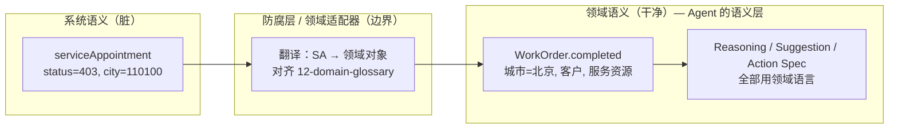

# 04 · 领域语义对齐（Agent 的语义层）

> 直觉：**我们每一步都是在做"领域"的事**。企业内部业务系统的语义，与领域语义
> 差异巨大；不按领域对齐，就很难通用化、扩展和产品化。本文把这个判断落成共识。

## 1. 问题：系统语义 ≠ 领域语义

XLink 后端（cloud / Mongo）说的是**系统语言**，充满历史包袱与实现细节：

| 系统语义（XLink 实现） | 领域语义（业务/产品/通用语言） |
|------------------------|-------------------------------|
| `serviceAppointment` 集合 | 工单 `WorkOrder` |
| `status = "403"` | 工单已完工 `WorkOrder.completed` |
| `status = "104/105/206..."` | 联系客户 / 预约上门 / 跟进签约（`taskType`） |
| `city = "110100"` | 北京 |
| `exts.contractStatus = "10"` | 合同已签约 |
| `exts.sourceType = "1"` | 自引单 |
| `state = -1` | 已作废 |

POC 当前把 `403`、`110100`、`state` 这些**系统码直接写进了引擎逻辑**。这能跑通，
但埋了一个战略隐患：**Agent 在用系统的"黑话"思考和产出建议**。

## 2. 为什么这对 agent-loop 是命门

agent-loop 的产出是 `Suggestion` / `Action Spec`——要给人看、要驱动 UI、最终要开源复用。

- 如果建议里写的是"status=403 的单子"，它**只对懂 XLink 的人有意义**，无法泛化。
- 我们的开源终局（[01-vision](PUB-01-vision.md)）是把这套运行时复用到 CRM / 招聘 / 医疗随访。
  这**完全依赖**一个稳定的领域语义层：Agent 只认领域概念（工单完工、待跟进、客户、
  服务资源），不认任何厂商系统的字段名。
- 这正是 DDD 的**通用语言（Ubiquitous Language）+ 防腐层（Anti-Corruption Layer）**：
  让混乱的外部系统语义，在边界处被翻译成干净、内聚、可演进的领域语义。

> **结论**：领域语义层 = **Agent 的语义层**。Agent 的"大脑"应当只在领域语言里推理。

## 3. 我们不是从零开始——已有可复用的领域资产

`business_3_0`（XLink 3.0 Web）团队已经建好了这一层，**不要重复造轮子**：

| 资产 | 位置 | 作用 |
|------|------|------|
| **领域词汇表（SSOT）** | `business_3_0/docs/12-domain-glossary.md` | 跨版本规范真源；定义 `WorkOrder` / `ServiceAppointment` / `WorkOrderActivity` / `Account` / `Contact` / `ServiceResource` / `Quote` / `Contract` 等边界与字段，且**与 Salesforce FSL 行业模型对齐** |
| **ERM 防腐层** | `business_3_0/web/lib/erm/` | `sources`（拉取）+ `mappers`（翻译）+ `enrichers`（富化）；`work-order-from-sa` 把 `serviceAppointment` → `WorkOrder` |
| **码表翻译** | `lib/sa-list-display-map.ts`、`lib/cloud-code-labels.ts` | `STATUS_TO_TASK_TYPE`（`403`→已完工）、`STATUS_TO_GROUP`、区划码→城市名 |

也就是说：**我们 POC 里硬编码的 `403`、城市码映射，上游早已有权威真源**。继续硬编码
= 在维护一份会漂移的影子真源。

## 4. 原则：翻译发生在边界，Agent 只见领域语言

**纪律**：所有 XLink 系统知识（码值、字段名、`exts` 路径）**只允许存在于防腐层一个地方**。
防腐层之外（推理、建议、Action Spec、追踪、推送），一律说领域语言。

## 5. 落地节奏：当下立"缝"，实现后置

对齐"奠基期原则：边界与命名先立，重实现后置"（见 glossary 文首）。

### 当下（Phase 1 POC）— 立 seam，成本极低
把已有的系统码隔离进**一个**领域适配器，让引擎其余部分说领域话：

- 把 `Job`（其实是 `serviceAppointment` 的形状）改造/重命名为领域对象 `WorkOrder`，
  并产出一个领域事件 `WorkOrderCompleted`。
- 新建唯一的 `domain_adapter`：集中 `status=403`、区划码、`state` 等所有翻译；
  **词汇与取值向 `12-domain-glossary` 看齐**（如 `taskType`、`group`、`completed`）。
- LLM prompt、Action Spec、企微卡片、追踪库字段——全部改用领域词（工单完工、
  待跟进、客户、城市名），不再出现 `403`。

> 这一步是**廉价保险**：不增加多少代码，却把"系统耦合"锁进一个文件，
> 为 Phase 2/3 的通用化铺好路。

### Phase 2（白盒内聚）— 共享单一领域真源
当 `business_3_0` 的 ERM/BFF 暴露领域读模型（领域 API 或共享包）时：

- agent-loop **改为消费领域对象**（`WorkOrder` + `WorkOrderActivity`），
  而非直连 Mongo 解析原始行——**消除影子真源**，码表只在 ERM 维护一份。
- Action Spec 引用**领域 id**（`workOrderId` / `accountId` / `serviceResourceId`），
  天然能被 Phase 2 的 Generative UI 审批卡片消费。
- Agent 产出的 `WorkOrderActivity`（一条跟进事实）可回流业务系统的活动时间序。

### Phase 3（抽象解耦开源）— 领域词汇成为协议
- 领域词汇表 + Action Spec 协议**抽离为开源运行时的核心契约**；
- XLink 沦为一个**绑定（binding）**：用配置/适配器接入；换成别的 CRM/HR 系统，
  只需换防腐层与 SOP 配置。
- 因为 glossary 本就**对齐 FSL 行业模型**，跨行业泛化的路已经铺好。

## 6. 治理纪律

1. **不 fork 词汇表**：`12-domain-glossary.md` 是领域 SSOT；agent-loop 引用它，不另立一份。
2. **缺概念就上游补**：若 agent-loop 需要 glossary 里没有的领域概念（如
   `FollowUpSuggestion`、`ActionSpec`），按 glossary 的变更规则提议补充，保持单一真源。
3. **系统码集中**：任何 `status` / `exts` / 区划码新增映射，进防腐层，并尽量复用
   `business_3_0` 的 `sa-list-display-map` / `cloud-code-labels` 口径。
4. **Action Spec 说领域话**：建议正文与字段用领域语言；引用对象用领域 id，不暴露系统码。

## 7. 一句话共识

> **agent-loop 不是在"读 XLink 的工单表"，而是在"对工单领域里发生的事件做出反应"。**
> 系统只是当下的数据来源；领域语义才是我们沉淀和开源的资产。

## 参见

- [01-vision](PUB-01-vision.md) · [02-architecture](PUB-02-architecture.md)（事件摄取原语 = 防腐层落点）· [03-roadmap](PUB-03-roadmap.md)
- `business_3_0/docs/12-domain-glossary.md`（领域 SSOT）
- `business_3_0/docs/11-field-service-reference.md`（FSL 行业参照）
- `business_3_0/web/lib/erm/`（既有防腐层实现）
