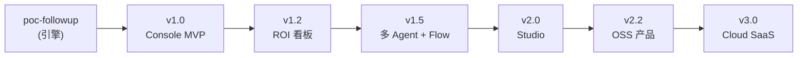

# 05 · 版本规划（产品化迭代 → Live）

> **Scope 起点**：Follow-up（工单 → AI 跟进建议 → 人工采纳 → 执行），并沿 FS-AOL 愿景扩展。
> **交付纪律**：每个正式版本必须 **完整闭环、可独立验证、可发布、且产品化**
> （有 tag、有验收清单、有回滚方式、**有 UI/UE/UX**），禁止「半个功能」或「脚本即版本」。
>
> 与 [PUB-03-roadmap.md](PUB-03-roadmap.md) 的关系：03 是平台演进 **Stage 0→3**；本文是 **工程可执行版本切分**。  
> 产品化纪律与产品脊柱（S1–S6）见 [PUB-07-product-surface.md](PUB-07-product-surface.md)。  
> **版本摘要时间线**：[PUB-changelog.md](PUB-changelog.md)（对齐 business_3.0 的 `docs/changelog.md`）。

## 两轨纪律（POC 轨 vs 产品轨）

> 我们要的是**通用 / 可开源 / 可云服务**的产品，「项目/脚本」不可作为正式交付。

- **POC 轨**：`poc-xxx`，headless 可，验技术与效果，**不进 SemVer 版本表**。
- **产品轨**：`vX.Y`，必须产品化（UI 表面 + UX 流程 + 可感知 KPI），方可打 tag。
- **当前定位**：`cron + 企微卡片 + DRY_RUN` = **`poc-followup` 引擎**；**`v0.2.x`** = Stage 0 **最小闭环产品**（引擎 + Console：S1+S2+轻量指标）；**`v1.0` tag** = v0.2.x 闭环与试点 KPI 证明后的**产品轨正式版**（见 [PUB-07](PUB-07-product-surface.md) §1）。
- 企微/短信降级为**通知渠道**（把人拉回 Console 处置），不再是产品本体。

> 详见 [PUB-07-product-surface.md](PUB-07-product-surface.md) §1 两轨、§3 产品化 Definition of Done。

## 版本总览（两轨）

> 阶段对应见 [PUB-03-roadmap.md](PUB-03-roadmap.md)：
> **Stage 0** 闭环系统 · **Stage 1** Agent Runtime · **Stage 2** AOL Core · **Stage 3** 开源生态。

### A. POC / 引擎轨（headless，喂给产品轨，不单独对外发布）

| 标记 | 代号 | 内容 | 状态 | 喂给 |
|------|------|------|------|------|
| `poc-followup` | scaffold + wedge | 防腐层 + trace + 混元/启发式 + steps enrich + 企微预览（原 v0.1/v0.2） | **`v0.1.0` + `v0.2.0` 已 tag** | v1.0 |
| `poc-cron` | pilot-cron | GHA 定时 + Turso 追踪 + 批量稳定性（原 v0.3） | 规划 | v1.0 / v1.2 |
| `poc-context` | context-sop | 上下文补全 + SOP v1（原 v0.4） | 规划 | v1.3+ |

> 引擎能力仍然重要，但它们是**产品的后端**，不再作为「面向用户的版本」。

### B. 产品轨（每个都产品化：UI + UX + 可感知 KPI）

| 版本 | 代号 | 产品一句话 | 新增产品脊柱 | 对应 Stage |
|------|------|------------|--------------|------------|
| **v1.0** | console-mvp | 在产品内**看见并处置** Follow-up 建议 | S1 + S2 | Stage 0→1 |
| **v1.1** | trust | 让用户**信任**：查证/推理轨可见 | S3 | Stage 1 |
| **v1.2** | proof | 让管理层**看见 ROI**：产品内看板/周报 | S4 | Stage 1 |
| **v1.3** | qualification | 复用外壳上线**第二个 Agent** | S1/S2 多 Agent 化 | Stage 1 |
| **v1.4** | estimate | 报价类 Agent 产品化 | 报价审批卡片 | Stage 1 |
| **v1.5** | flow | Agent 间编排**可见可干预** | S5 雏形 | Stage 1→2 |
| **v2.0** | studio | 用户在 UI 内**配置** Agent/规则/SOP | S5 完整 | Stage 2 |
| **v2.1** | self-host | 可独立部署的**产品**（非脚本） | onboarding UX | Stage 2 |
| **v2.2** | oss-core | 开源「**带 Console 的可运行产品**」 | 开源版 Console | Stage 3 |
| **v3.0** | cloud-saas | 托管**多租户**产品 | S6 | Stage 3 |
| **v3.1** | marketplace | 第三方 Agent **可上架** | 市场页 + 安装流 | Stage 3 |



---

## 横切策略（全版本有效）

### 数据：真实优先，mock 降级

| 环境 | `FSM_SOURCE` | 库 |
|------|--------------|-----|
| **v0.2 起默认** | `mongo` | dev `xlinkdemo`（只读） |
| 试点 / Live | `mongo` | dev → prod `xlink` 分阶段切换 |
| 仅 CI 离线 | `mock` | 无网跑结构测试，**不作为封版路径** |

### LLM：免费为主，付费验证（见 [06-llm-providers.md](PUB-06-llm-providers.md)）

| `LLM_PROVIDER` | 用途 |
|----------------|------|
| **heuristic** | 走通非 LLM 链路（捞取、trace、企微预览），零 API 成本 |
| **hunyuan**（默认） | 腾讯混元 Lite，对齐 stockwise 免费档 |
| **deepseek** | 抽样对比质量；业务演示时再开 |

**纪律**：日常开发与 cron 用混元；DeepSeek 只用于「每周 N 单对照样本」，不作为默认成本模型。

---

## 产品轨 OKR/KPI 总表

> 每个产品版本 = 一个可证伪的 KPI + 一块新增 UI + 明确 Scope 护栏。
> KPI 阈值（X/N/%）待各版立项时拍定，先固定**指标口径**。

| 版本 | O（目标） | KR / KPI（可感知 / 被使用 / ROI） | 新增 UI | Scope 护栏（明确不做） | 闭环定义 |
|------|----------|-----------------------------------|---------|------------------------|----------|
| **v1.0** console-mvp | 让人在产品内看见并处置 Follow-up 建议 | App 内处置率 ≥70%（非靠翻群）；审批时延中位数 < N 分 | S1 总览 + S2 收件箱/审批 | 不做多 Agent、不做配置 UI | 管家在 Web 内完成「看→处置」 |
| **v1.1** trust | 让用户信任建议 | 查证可见率 100%；「看得懂为什么」满意度达标 | S3 推理/查证轨 | 不改推理算法本身 | 每条建议可溯源到证据 |
| **v1.2** proof | 让管理层看见 ROI | 1 个核心指标可视化；周报产品内生成且被引用 | S4 ROI 看板 | 不做精确归因 | 1 份管理层认可的看板/周报 |
| **v1.3** qualification | 第二个 Agent 复用外壳 | UI 组件复用率 ≥80%；线索分级准确率达标 | S1/S2 多 Agent 视图 | 不做跨 Agent 编排 | 第二个 Agent 在同 Console 可用 |
| **v1.4** estimate | 报价类 Agent 产品化 | 报价时间 −X%；草稿采纳率达标 | 报价审批专用卡片 | 不自动发客户 | 报价草稿在产品内生成+审批 |
| **v1.5** flow | Agent 间编排可见 | 1 条端到端链路 UI 可视化 + 可干预 | S5 流程视图雏形 | 仅顺序流，不做并行/回滚 | 链路在产品内可看可停 |
| **v2.0** studio | 用户可自配置 | 非工程人员能在 UI 改一条规则/话术并生效 | S5 完整 Studio | 不开放任意代码执行 | 配置项产品内自助生效 |
| **v2.1** self-host | 输出可部署产品 | 外部用 mock 数据 1 天内装好并见 Console | 安装/onboarding UX | 不含云计费 | 自托管实例可运行 |
| **v2.2** oss-core | 开源带 Console 的产品 | 外部可运行实例数；stars/贡献者达阈值 | 开源版 Console | Industry Pack 不开源 | 第三方 48h 跑通同链路 |
| **v3.0** cloud-saas | 托管多租户产品 | 首批 N 租户；onboarding 转化；隔离+计费跑通 | S6 Tenant Admin | 不做无限定制 | 租户自助开通并使用 |
| **v3.1** marketplace | 生态扩张 | 上架 Agent 数；调用量 / GMV | 市场页 + 安装流 | 不自营所有 Agent | 第三方 Agent 可上架运行 |

> **双轴自检**（每版立项前）：能力轴推进了哪一格（被动→主动 / 单点→多点 / 内聚→可复用）？
> 商业轴 KPI 是内部 ROI、外部采用、还是收入？**三者不在同一版本混用。**

---

> **以下为引擎/能力明细（多属 POC/引擎轨）**：描述后端能力、验收与运维硬化。
> 产品轨的 UI/UX 验收以上文「产品轨 OKR/KPI 总表」与 [PUB-07-product-surface.md](PUB-07-product-surface.md) 为准；
> 这些引擎能力作为对应产品版本的后端被消费。

---

## v0.1 · scaffold（已发布 `v0.1.0`） — POC/引擎轨

**目标**：证明 **Event → Reasoning → Trace → Outbound → 幂等** 技术路径可跑通，零侵入 XLink。

### 已交付

| 能力 | 说明 |
|------|------|
| 领域防腐层 | `domain.py`：`serviceAppointment` → `WorkOrder` |
| 摄取 | `FSM_SOURCE=mongo`（dev）/ `mock`（CI） |
| 推理 | `heuristic` / `hunyuan` / `deepseek`；trace 全量落库 |
| 执行 | 企微 Markdown；**默认 `DRY_RUN=true` 预览** |
| E2E | `--reset-tracking` 清表（保留 db 文件，GUI 可刷新） |
| 文档 | `05`–`07`、`xlink-data` |

### 已知边界（v0.2 要解决）

- 事件源仅 `status=403` 已完工，与业务主战场 **206 待签约** 不匹配。
- 无管家维度路由（`exts.supervisorId`）。
- 输出为扁平建议，尚无 **Action Spec + Approval** 契约。

---

## v0.2.x · 最小闭环产品（Stage 0 原型）

**阶段目标（v0.2.1 → v0.2.3）**：**产品结构补齐 + 业务闭环跑通**，再进入 **`v0.3.0` 规模化试点**。
`v0.2.x` = 引擎楔子（`v0.2.0`）+ Console 最小表面（S1 总览 + S2 收件箱/处置 + 轻量闭环指标），仍是 Stage 0，不是产品轨 `v1.0`。

| 小版本 | 主题 | 状态 |
|--------|------|------|
| **v0.2.0** | engine wedge（206 + steps + 生产只读 DRY_RUN） | ✅ `v0.2.0` |
| **v0.2.1** | 产品结构缺口（卡片 → Console、阻塞回填） | ✅ `v0.2.1` |
| **v0.2.2** | 业务语义（管家收件箱、已跟进、outcomes 可读） | ✅ `v0.2.2` |
| **v0.2.3** | 闭环指标（Console 轻量 KPI + 7 日离 206 率脚本） | ✅ `v0.2.3` |
| **v0.2.4** | Console 收口（生产 E2E + 收件箱 UX + state_at + 排序） | ✅ `v0.2.4` |

> **产品轨 `v1.0` tag 纪律**：在 v0.2.x 闭环被证明且试点 KPI 达标（如 App 内处置率 ≥70%）后再打；见 [PUB-07-product-surface.md](PUB-07-product-surface.md) §1。

---

## v0.2.0 · follow-up-wedge（已发布 `v0.2.0`，2026-05-31）

**目标**：对齐研讨 **Follow-up Action Engine** 切口——在 **wait → follow-up** 主战场产生可审批建议，
用四位管家（刘沐泽、李小军、刘清瑞、李俊达）**生产只读**数据验证 ROI。

> **封版说明**：`v0.2.0` 锚定楔子里程碑（206 + steps + Action Spec v0.2 + 试点管家 + 生产只读 DRY_RUN）。
> 同期 main 上已落地 **Turso 追踪 + GHA cron**（原 `poc-cron` / 旧 v0.3 工程项），**不并入 `v0.2.0` tag 语义**；`v0.3.0` 另打 tag，聚焦**闭环成立后的规模化试点**（真发企微、cron 硬化、run_summary、runbook），而非「第一个 Console」。

**规格 SSOT**：私有文档 `docs/private/PRIV-08-follow-up-wedge-spec.md`（含 **§6 v0.2.0 封版共识**）

### v0.2.0 封版共识（已定）

| # | 项 | 决定 |
|---|-----|------|
| 1 | 数据 | **生产 `xlink` 只读**；dev 仅开发调试 |
| 2 | 企微 | **不发群**；`DRY_RUN=true` 审阅卡片/日志 |
| 3 | Agent | **`AGENT_MODE=steps` 必做**；enrich 产出 **业务查证**（仅报价 B + 签约）并展示在卡片与 trace |

### 交付范围

| 原语 | 本版 |
|------|------|
| Event Ingestion | P0：**仅 `206` 待签约** 停滞 SLA；204 不纳入；归属 `exts.supervisorId` |
| Reasoning | 混元默认；prompt 含 **状态 + 停留天数**；仍只读 Mongo |
| Action Spec | 扩展 `FollowUpSuggestion` → 含 `event_type`、`stale_days`、`housekeeper_id` |
| Execution | 企微卡片按管家分送（试点）；仍为 **approval 前 suggestion** |
| 可观测 | trace 增加 `event_type`；水位线按 `(event_type, work_order_id)` |

### v0.2 验收清单（打勾即 tag `v0.2.0`）

**工程（dev 可先验）**

- [x] dev 只读：能捞到 **206** 工单（204 已排除；14 天窗）
- [x] 管家路由：卡片带归属管家 / 状态 / 停留天数 / 事件类型
- [x] `dedupe_key` 幂等；`reasoning_traces.event_type` + `steps_json`
- [x] `LLM_PROVIDER=hunyuan` + `DRY_RUN` 预览；`--reset-tracking`
- [x] 文档：08 / 09 / sops 大纲
- [x] `AGENT_MODE=steps` + enrich（仅报价 B、签约、`business_verdict`）
- [x] 卡片含 **系统查证** 行（steps 模式）

**封版（必须生产只读）** — `v0.2.0` 已验收（2026-05-31）

- [x] **生产 `xlink`**：`FSM_EVENT_STATUSES=206` + `FSM_MAX_AGE_DAYS=14` + 四位管家，能捞取并推理
- [x] **`AGENT_MODE=steps`**：日志/卡片中 **查证结论** 与建议一致（已签约不单催签等）
- [x] **不发群**：仅 `DRY_RUN=true` 审阅卡片/日志（封版按共识接受，非正式 ≥10 卡盲评）
- [x] ADR-008 与本节共识已写入 changelog（见 [PUB-changelog.md](PUB-changelog.md) `v0.2.0`）

### v0.2.1 · 产品结构缺口（已发布 `v0.2.1`，2026-05-31）

**目标**：补齐「从通知回到 Console 处置」与阻塞上下文采集的**最小产品结构**；不扩业务语义。

**交付范围**：

| 项 | 说明 |
|----|------|
| 卡片深链 | 企微/预览卡片可 **deep link 进 Console** 对应工单/建议 |
| 阻塞展示 | 卡片默认 **`阻塞信息：待采集`**（未知不伪造） |
| 阻塞回填 UI | 最小回填：`A价格/B时机/C方案/D无响应 + 一句话`；先落 `reasoning_traces`（或等价轻量表），**不改 XLink 主库** |

**验收清单（打勾即 tag `v0.2.1`）**：

- [x] 卡片 → Console 深链：试点管家能从卡片一键打开对应处置页
- [x] 卡片含 **`阻塞信息：待采集`**；无回填时为 `UNKNOWN`
- [x] 5 条样本：管家 **≤10 秒** 完成回填；字段写入 trace 且下一轮推理可读
- [x] 无回填时不伪造阻塞结论

---

### v0.2.2 · 业务语义（已发布 `v0.2.2`，2026-05-31）

**目标**：让管家在 Console 内完成 **筛选 → 处置 → 采纳信号**，且 outcomes 可供下一轮推理消费。

**交付范围**：

| 项 | 说明 |
|----|------|
| 管家收件箱 | Console **按管家过滤**（试点四位 + 待处置状态） |
| 已跟进语义 | **`已跟进`** 采纳/处置状态入库（轻量 outcomes），对齐 ADR-011 采集纪律 |
| 推理可读 | outcomes / 阻塞回填可被 **下一轮 cron/推理** 读取并体现在建议中 |

**验收清单（打勾即 tag `v0.2.2`）**：

- [x] 管家登录/选择后，收件箱仅见本人（或试点池）相关建议
- [x] 「已跟进」可在产品内标记且持久化；trace/outcomes 可查询
- [x] 至少 3 条样本：标记已跟进后，下一轮建议体现 prior outcome（非重复空催）

---

### v0.2.3 · 闭环指标（已发布 `v0.2.3`，2026-05-31）

**目标**：在 Console 内**可感知**闭环是否成立；运维侧只读脚本支撑 7 日业务对照。

**交付范围**：

| 项 | 说明 |
|----|------|
| Console 轻量 KPI | 如：待处置数、已跟进占比、阻塞采集率（`UNKNOWN` 占比） |
| 7 日离 206 率 | **只读 Mongo** 脚本 `scripts/advancement_rate.py`（dev/prod 分环境），输出 7 天内离开 206 的粗率，供试点评审 |
| 文档 | 指标口径写入 05/07；脚本用法见下 |

**脚本用法**（仓库根目录，与 `run_cron` 相同 env）：

```bash
python scripts/advancement_rate.py
python scripts/advancement_rate.py --limit 50 --window-days 7
```

**验收清单（打勾即 tag `v0.2.3`）**：

- [x] Console 一屏可见 ≥2 个闭环相关指标（有埋点/可查）
- [x] 只读脚本在 dev 或生产只读账号下可跑通并产出可复现数字
- [x] v0.2.x 阶段门：业务方认可「可在 Console 完成看→处置→记 outcome」闭环演示

---

### v0.2.4 · Console 收口（已发布 `v0.2.4`，2026-05-31）

**目标**：在 v0.2.3 阶段门基础上，完成 **生产 E2E** 与 **Console 收件箱可用性** 收口，正式结束 v0.2.x 线。

**交付范围**：

| 项 | 说明 |
|----|------|
| 生产 E2E | GHA cron（北京 08:00–22:00  hourly）+ Turso 追踪 + 企微紧凑卡 + Console 深链（`CONSOLE_BASE_URL`） |
| Console 认证 | 详情/阻塞 API 公开；列表需登录；试点管家 URL/cookie 筛选 |
| 收件箱 UX | 四层信息（工单 / 情况 / 动作 / 处置）；紧凑行布局；平铺排序（最新 / 管家 / 滞留 / 优先级 / 处置） |
| 滞留口径 | `follow_up_logs.state_at` 入库工单 `updateTime`；Console **展示时现算**滞留天数 |
| Trace | 查证结论 + 竖向时间线 + 折叠调试信息 |
| 本地闭环 | `make seed-local` + webpack dev + 共用 `data/agent_loop_tracking.db` |
| 预备 | 企微应用消息模块（`wecom_app.py`，v0.3 部署路径） |

**验收清单（打勾即 tag `v0.2.4`）**：

- [x] GHA cron 手动/定时跑通：引擎写 Turso、企微 webhook 可达、Console 深链可开
- [x] 收件箱可扫读：无横向滚动；工单事实与建议时间分离；滞留随日历递增
- [x] 排序与管家筛选可组合（URL 持久化）
- [x] v0.2.x 收口共识：产品方认可当前 Console + 通知链路，可进入 v0.3 规模化试点

---

### agent-steps（v0.2.0 主验收轨）

见私有文档 `docs/private/PRIV-10-agent-steps-demo.md`。**封版必须用 `steps`**；`oneshot` 保留作对照/降级。

### 本地运行参考

```bash
cp .env.example .env
pip install -r requirements.txt
python run_cron.py --reset-tracking
```

---

## v0.3.0 · scale pilot（规模化试点，建议 1–2 周）

**目标**：在 **v0.2.x 最小闭环产品已跑通** 之后，做第一次 **7×24 真发企微 + 运维可运营** 的规模化试点——**不是第一个 Console**（Console 在 v0.2.1–v0.2.3 已落地）。

> **先行工程（已在 main，不打进 v0.2.x tag）**：**Turso 追踪 + GHA cron** 已验证；`v0.3.0` tag 语义 = 在闭环成立后的 **cron 硬化、真发、可观测、runbook**，而非重复交付 Turso/GHA 脚手架。

### 交付范围

| 原语 | 本版增厚 |
|------|----------|
| Event Ingestion | 与 v0.2.0 相同口径（206 + 试点管家）；prod 只读账号按 runbook 切换 |
| Reasoning | 默认 **hunyuan**；trace 以 **Turso** 为主（与现网一致） |
| Action Spec | 保持 v0.2 Action Spec + 卡片深链回 Console |
| Execution | **真发试点群** webhook（非仅 `DRY_RUN`）；失败重试；**每日上限**（防刷屏） |
| 可观测 | 每轮 **`run_summary`**（处理数/成功/失败/token）；artifact 或表可查 |

### 工程项

1. Cron **硬化**：Secrets/Vars、限流、`FSM_LOOKBACK_HOURS` / `FSM_BATCH_LIMIT` 生产默认值；连续运行无人工笔记本依赖。
2. **`run_summary`**：每轮结束可回答「昨晚处理了多少、失败原因」。
3. **Runbook**：`docs/runbooks/pilot-cron.md`（手动触发、停 cron、查 trace/Turso、回滚 tag）。
4. 阻塞/采纳周报：对接 v0.2.3 指标（采集率、已跟进占比、`UNKNOWN` 占比）输出试点周报。

### 明确不做

- 不重做 Console MVP（属 v0.2.x）；不升产品轨 `v1.0`。
- 不改 XLink 业务主库；不接 SOP 向量库（留给 v0.4）。

### 发布与验证

- **发布**：打 tag `v0.3.0`；Actions schedule 仅试点时段（如工作日 9–18）+ `workflow_dispatch`。
- **验证**：
  - 连续 3 天 cron 无人工干预；trace + `run_summary` 可查；无重复推送。
  - 试点群真发：业务方「建议可读、无胡言」≥10 条样本评审。
  - Console 处置与群通知可对照（深链可达、已跟进状态一致）。

---

## v0.4 · context-sop（建议 2–3 周）

**目标**：提升建议质量——补全跟进文本素材，注入首版防水维修 SOP。

### 交付范围

| 原语 | 本版增厚 |
|------|----------|
| Event Ingestion | 防腐层扩展：按 `work_order_id` 关联 `workflowNode` / 关键 `exts`（只读） |
| Reasoning | SOP v1（Markdown/JSON 配置）拼入 system prompt；可选「仅高优先级才推送」 |
| 可观测 | `follow_up_logs` 增加 `sop_version`、`context_sources`；trace 增加 `context_snapshot` |

### 工程项

1. `domain.py`：`enrich_work_order_context(wo)` 只读补全。
2. `sops/waterproof-follow-up-v1.md`（配置，非硬编码业务 if-else）。
3. 配置开关：`REQUIRE_FOLLOW_UP_ONLY_HIGH=false` 等试点调参。
4. 把已采集的阻塞类型接入 SOP 话术分支（无采集仍走 `UNKNOWN` 通道）。

### 明确不做

- Action Spec 协议升级（v1.1）。
- business_3_0 嵌入（v1.2）。

### 发布与验证

- **发布**：tag `v0.4.0`；试点群切换或并行 A/B（旧版 vs 新版）一周。
- **验证**：
  - 对比 v0.3：业务盲评「更有用」比例 ≥ 60%（样本≥20）。
  - describe 为空的工单，补全后建议非空率提升可量化。

---

## v0.5 · proof-metrics（建议 2 周）

**目标**：Stage 1 **可量化证明包**——管理层能看懂的数字，不是「感觉 AI 有用」。
这正是 roadmap 强调的「必须先赢一个闭环业务指标」。

### 交付范围

| 能力 | 说明 |
|------|------|
| 建议曝光 | 每条推送带 `suggestion_id`，企微卡片 footer 可选手工标记 |
| 采纳信号 v1 | 轻量：群消息反应 / 表单链接「已处理/忽略」/ 或运营 Excel 回灌脚本 |
| 效果指标 | 脚本 `scripts/weekly_proof_report.py`：推送数、采纳率、高优先级占比、token 成本 |
| 业务对照 | 可选：与 Metabase/现有报表对齐「同期完工单 → 二次签约」粗对比 |

### 工程项

1. DB 表：`suggestion_outcomes`（work_order_id, suggestion_id, outcome, noted_at）。
2. 周报 Markdown 自动生成（可贴企微文档或邮件）。

### 明确不做

- 全自动 CRM 写回（v1.1+）。
- 精确归因（因果证明留业务分析，引擎只提供分母分子）。

### 发布与验证

- **发布**：tag `v0.5.0`；连续 2 周出周报。
- **验证**：
  - 至少 1 份对管理层可读的「AI 跟进试点周报」被采用。
  - 有明确数字：如「推送 N 条，人工确认跟进 M 条，其中 X 条带来二次触达/签约线索」。

---

## 引擎能力：live 硬化（并入产品轨 v1.x 后端）

> 原 `v1.0 live-phase1`。现作为产品轨 v1.0–v1.2 的**生产硬化能力**，不再单列为面向用户的版本。

**目标**：生产 Cron、SLO、告警、权限与合规收口（支撑产品 Live）。

### 交付范围

| 维度 | 标准 |
|------|------|
| 数据 | prod `xlink` 只读；口径与私有文档 `docs/private/PRIV-xlink-data.md` 签字确认 |
| 运行 | GitHub Actions 或等价调度；Turso 追踪；Secrets 轮换流程 |
| 可靠性 | 单轮失败不影响下轮；LLM/企微失败有告警（邮件/企微运维群） |
| 安全 | 密钥不进库；日志脱敏 phone；只读账号最小权限 |
| 文档 | Runbook、架构图、on-call 一页纸 |

### SLO 建议（首期）

- Cron 成功率 ≥ 99%（排除上游 Mongo 不可用）。
- 单工单端到端 P95 &lt; 60s（含 LLM）。
- 重复推送率 = 0（幂等）。

### 发布与验证

- **发布**：tag `v1.0.0`；生产群（非仅试点）或分城市分群路由。
- **验证**：
  - 连续 30 天无 P0 事故。
  - 业务方签字「Stage 1 可常态化运行」。

**首个 Live 定义**：黑盒、企微为主、人类采纳；**不承诺**产品内审批与自动写 CRM。

---

## 引擎/平台能力：Stage 2（Product → Platform：AOL Core 成型）

> 以下能力支撑产品轨 v1.1–v2.x；产品形态与 UI 验收以产品轨总表为准。

**Action Spec 协议（支撑 v1.1 trust / v2.0 studio）**

- `FollowUpSuggestion` → 强类型 **Action Spec**（`action_type` / `ui_component` / `payload`）。
- 审批结果 webhook 回写 `suggestion_outcomes`；JSON Schema 校验 + `spec_version`。
- **验证**：mock Spec 可独立 JSON 校验；至少 2 种 `action_type` 端到端。

**确定性执行（支撑 v2.x）**

- 审批后确定性执行（企微发客户草稿 / CRM 字段更新经 Guardrails API）。
- Event Ingestion 改消费 **ERM 领域读模型**，删除直连 Mongo 的影子路径。
- SOP 向量检索（可选 RAG）上线。
- **验证**：单客服跟进吞吐量提升可量化；漏跟率下降。

---

## 引擎/平台能力：Stage 3（开放生态：开源 + Marketplace）

> 支撑产品轨 v2.2 oss-core / v3.0 cloud-saas / v3.1 marketplace。
> 分层开源纪律见 [PUB-03-roadmap.md](PUB-03-roadmap.md)：**只开源 AOL Core Runtime**；
> Industry Packs / Data Intelligence / Hosted Platform 保持商业护城河。

- 防水业务 → `bindings/xlink-wpf.yaml` + SOP 包（Industry Pack，不开源）。
- **AOL Core Runtime（开源）**：`fs-aol-runtime`，含 Event Bus / Agent Runtime /
  Workflow / 基础 Memory + 四原语（ingestion / reasoning / spec / execution）。
- Agent SDK（`onEvent → loadContext → decide → act`）与 Generative UI 组件库独立 npm 包。
- 远期：Agent Marketplace（第三方 Agent 挂载运行）。

**验证**：第三方仓库用 mock binding 48h 内跑通同样链路。

---

## 迭代节奏建议

| Stage | 轨道 / 版本 | 日历（参考） | 决策门 |
|------|------------|--------------|--------|
| Stage 0 闭环 | POC `poc-followup` 封版 | 本周 | 生产只读 + steps E2E + trace |
| Stage 0→1 试点 | POC `poc-cron` → `poc-context` | 第 2–5 周 | GHA cron + 提质（SOP/上下文） |
| **Stage 0→1 产品起点** | **产品 v1.0 console-mvp** | 第 6–9 周 | **首块可见产品：S1+S2 + 安全/运维签字** |
| Stage 1 信任/证明 | 产品 v1.1 → v1.2 | 第 10–14 周 | 查证可见 + ROI 看板被引用 |
| Stage 1→2 多 Agent/编排 | 产品 v1.3 → v1.5 | 第 15–24 周 | 复用率达标 + 编排可见可干预 |
| Stage 2 平台化 | 产品 v2.0 → v2.1 | 半年+ | UI 内可配置 + 可自托管 |
| Stage 3 开源/云 | 产品 v2.2 → v3.1 | Year 1+ | 闭环指标成立 + Core 与 Pack 边界清晰 |

**决策门纪律**：未达上一版验收清单，**不启动下一版开发**（可并行写文档与运维准备）。

---

## 每版通用「可发布」检查单

复制到每个 PR / Release Notes：

1. **闭环**：Event → Reasoning → Trace → Outbound → 水位线 全路径可演示。
2. **可验证**：开发路径 `DRY_RUN=true`（真数据+真 LLM+企微预览）；试点/Live 再单独验真发。
3. **可回滚**：上一 tag 可一键恢复；Cron 可 disable。
4. **可观测**：能回答「昨晚 3 点为什么没推？」（trace + run_summary）。
5. **领域纪律**：系统码只出现在 `domain.py`（或 binding 配置）。
6. **文档**：README + 本文件该版本节 + Runbook 变更。
7. **产品化达标（仅产品轨 `vX.Y`）**：UI 表面 + UX 流程齐全；用户能在产品内回答该版本对应
   产品脊柱（S1–S6）的核心问题；可感知 KPI 有埋点。见 [PUB-07-product-surface.md](PUB-07-product-surface.md)。

---

## 参见

- [PUB-01-vision.md](PUB-01-vision.md) · [PUB-02-architecture.md](PUB-02-architecture.md) · [PUB-03-roadmap.md](PUB-03-roadmap.md)
- [PUB-04-domain-semantics.md](PUB-04-domain-semantics.md) · [PUB-07-product-surface.md](PUB-07-product-surface.md) · 私有文档 `docs/private/PRIV-xlink-data.md`
